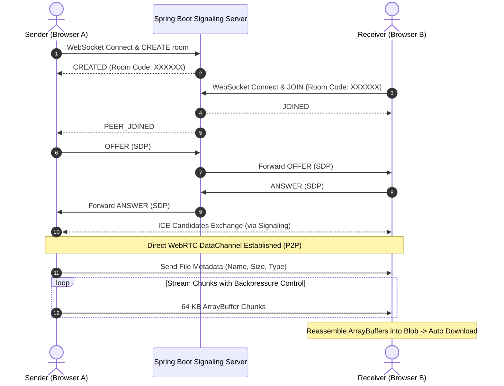

# ⚡ PeerLink — Real-Time Peer-to-Peer (P2P) File Sharing

**PeerLink** is a decentralized, browser-to-browser file transfer application built with **React**, **WebRTC**, and a lightweight **Spring Boot** signaling server. Files are streamed directly between peers using encrypted WebRTC DataChannels, ensuring high transfer speeds, maximum privacy, and **zero server storage or bandwidth overhead**.

---

## 🚀 Key Features

- **Decentralized P2P Transfers**: Direct peer-to-peer data transmission using WebRTC Data Channels without storing files on any intermediate server.
- **WebSocket Signaling Backend**: Fast, lightweight signaling service powered by Spring Boot (Java 21) for room management, SDP offer/answer exchange, and ICE candidate negotiation.
- **Client-Side Backpressure Control**: Dynamically regulates chunk streaming (`bufferedAmount` & `bufferedAmountLowThreshold`) to prevent browser buffer overflow and memory leaks during large file transfers.
- **Chunked Binary Streaming**: Slices files into 64 KB binary chunks (`ArrayBuffer`) and transmits them in an ordered stream.
- **Automatic Blob Reassembly**: Reconstructs binary chunks on the receiver side and triggers automatic file download upon completion.
- **Simple 6-Character Room Codes**: Instant room generation and pairing for secure 1-to-1 file transfer sessions.

---

## 🏗️ Architecture & Workflow



---

## 🛠️ Tech Stack

| Layer | Technologies |
|---|---|
| **Frontend** | React 19, Vite, WebRTC (`RTCPeerConnection`, `RTCDataChannel`), JavaScript (ES6+) |
| **Backend** | Java 21, Spring Boot (WebSocket API, TextWebSocketHandler), Jackson |
| **Protocols & Networking** | WebRTC (DataChannel), WebSocket (`ws://`), STUN (`stun:stun.l.google.com:19302`), ICE, SDP |

---

## 📁 Repository Structure

```text
peerlink/
├── backend/                  # Spring Boot Signaling Server
│   ├── pom.xml
│   └── src/main/java/com/peerlink/
│       ├── PeerlinkApplication.java
│       ├── config/
│       │   └── WebSocketConfig.java       # WebSocket endpoint mapping (/ws/signal)
│       ├── handler/
│       │   └── SignalSocketHandler.java   # Concurrency-safe signal routing & room state
│       └── model/
│           └── SignalMessage.java         # Signal payload DTO
│
├── frontend/                 # React 19 + Vite Frontend
│   ├── package.json
│   ├── vite.config.js
│   └── src/
│       ├── App.jsx           # WebRTC logic, chunking, backpressure & UI
│       ├── main.jsx
│       └── index.css
│
└── README.md
```

---

## ⚡ Getting Started

### Prerequisites

- **Java Development Kit (JDK)**: Version 21 or higher
- **Maven**: 3.8+ (or use the included `./mvnw` wrapper)
- **Node.js**: v18+ and **npm**

---

### 1. Start the Signaling Server (Backend)

1. Open a terminal and navigate to the `backend` directory:
   ```bash
   cd backend
   ```
2. Build and run the Spring Boot application:
   ```bash
   ./mvnw spring-boot:run
   ```
3. The signaling server will start listening on `ws://localhost:8080/ws/signal`.

---

### 2. Start the Client (Frontend)

1. Open a new terminal and navigate to the `frontend` directory:
   ```bash
   cd frontend
   ```
2. Install dependencies:
   ```bash
   npm install
   ```
3. Run the development server:
   ```bash
   npm run dev
   ```
4. Open `http://localhost:5173` in your browser.

---

## 📖 How to Use

1. **Sender**:
   - Click on **"Send a File (Create Room)"**.
   - Copy the generated 6-character room code.
   - Choose the file you want to transfer.
2. **Receiver**:
   - Paste the 6-character code into the input box and click **"Receive"**.
3. **Transfer**:
   - The Sender clicks **"Start Direct Transfer"**.
   - Watch the real-time progress bar update as chunks stream directly between browsers.
   - The Receiver automatically downloads the file once all chunks arrive.

---

## 🛡️ Security & Privacy

- **Zero Intermediary Storage**: File contents never pass through or touch the backend server.
- **End-to-End Encryption**: WebRTC DataChannels are encrypted by default using **DTLS** (Datagram Transport Layer Security) and **SCTP**.

